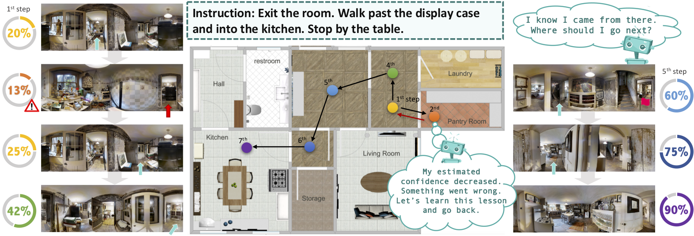
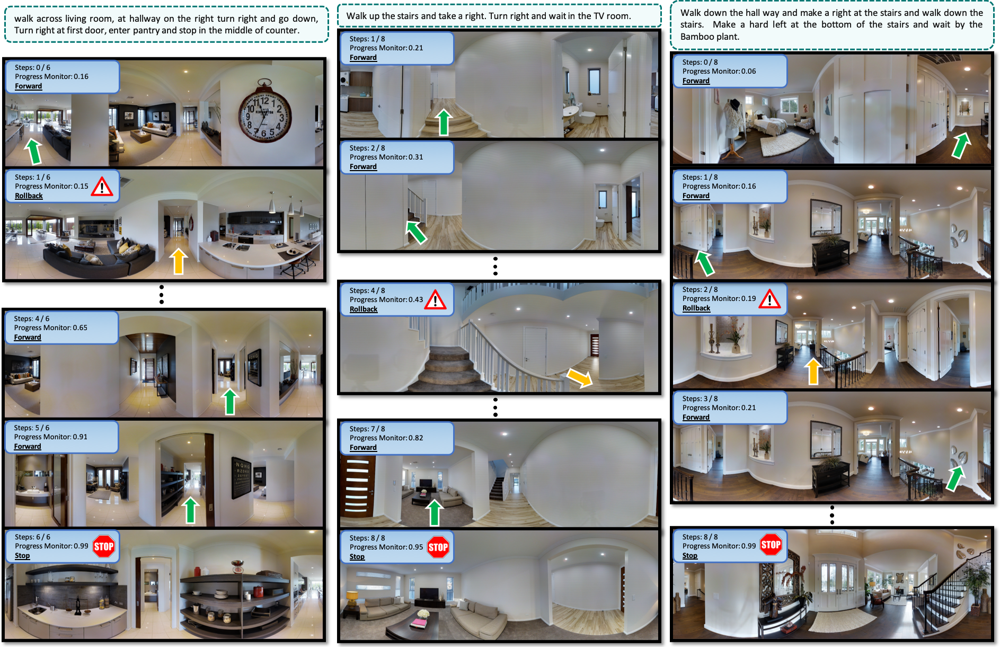
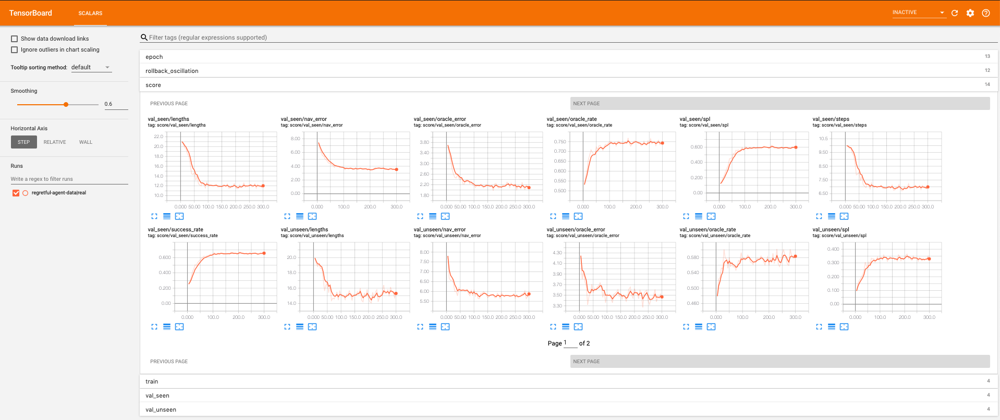

## The Regretful Navigation Agent for Vision-and-Language Navigation
 [](https://opensource.org/licenses/MIT) 

This is the PyTorch implementation of our paper: 

**The Regretful Agent: Heuristic-Aided Navigation through Progress Estimation**<br>
[__***Chih-Yao Ma***__](https://chihyaoma.github.io/), [Zuxuan Wu](http://zxwu.azurewebsites.net/), [Ghassan AlRegib](https://ghassanalregib.com/), [Caiming Xiong](http://www.stat.ucla.edu/~caiming/), [Zsolt Kira](https://www.cc.gatech.edu/~zk15/)<br>
IEEE Conference on Computer Vision and Pattern Recognition (CVPR), 2019 **(Oral)**<br>

[[arXiv](https://arxiv.org/abs/1903.01602)] [[GitHub](https://github.com/chihyaoma/regretful-agent)] [[Project](https://chihyaoma.github.io/project/2019/02/25/regretful.html)]


<p align="center">

</p>

## Abstract
As deep learning continues to make progress for challenging perception tasks, there is increased interest in combining vision, language, and decision-making. Specifically, the Vision and Language Navigation (VLN) task involves navigating to a goal purely from language instructions and visual information without explicit knowledge of the goal. Recent successful approaches have made in-roads in achieving good success rates for this task but rely on beam search, which thoroughly explores a large number of trajectories and is unrealistic for applications such as robotics. In this paper, inspired by the intuition of viewing the problem as search on a navigation graph, we propose to use a progress monitor developed in prior work as a learnable heuristic for search. We then propose two modules incorporated into an end-to-end architecture: 1) A learned mechanism to perform backtracking, which decides whether to continue moving forward or roll back to a previous state (Regret Module) and 2) A mechanism to help the agent decide which direction to go next by showing directions that are visited and their associated progress estimate (Progress Marker). Combined, the proposed approach significantly outperforms current state-of-the-art methods using greedy action selection, with 5% absolute improvement on the test server in success rates, and more importantly 8% on success rates normalized by the path length.

<br>
<p align="center">

</p>

## Installation / Build Instructions

### Prerequisites

A C++ compiler with C++11 support is required. Matterport3D Simulator has several dependencies:
- [Ubuntu](https://www.ubuntu.com/) 14.04, 16.04, 18.04
- [OpenCV](http://opencv.org/) >= 2.4 including 3.x 
- [OpenGL](https://www.opengl.org/)
- [OSMesa](https://www.mesa3d.org/osmesa.html)
- [GLM](https://glm.g-truc.net/0.9.8/index.html)
- [Numpy](http://www.numpy.org/)
- [pybind11](https://github.com/pybind/pybind11) for Python bindings
- [Doxygen](http://www.doxygen.org) for building documentation

E.g. installing dependencies on Ubuntu:
```
sudo apt-get install libopencv-dev python-opencv freeglut3 freeglut3-dev libglm-dev libjsoncpp-dev doxygen libosmesa6-dev libosmesa6 libglew-dev
```

For installing dependencies on MacOS, please refer to [Installation on MacOS](install_macOS.md).

### Clone Repo
Clone the Regretful Agent repository:
```
# Make sure to clone with --recursive
git clone --recursive https://github.com/chihyaoma/regretful-agent.git
cd regretful-agent
```

If you didn't clone with the `--recursive` flag, then you'll need to manually clone the pybind submodule from the top-level directory:
```
git submodule update --init --recursive
```

Note that our repository is based on the [Matterport3DSimulator](https://github.com/peteanderson80/Matterport3DSimulator), which was originally proposed with the Room-to-Roon dataset. 

### Directory Structure

- `connectivity`: Json navigation graphs.
- `img_features`: Storage for precomputed image features.
- `data`: You create a symlink to the Matterport3D dataset.
- `tasks`: Currently just the Room-to-Room (R2R) navigation task.

Other directories are mostly self-explanatory.

### Dataset Download

[Matterport3DSimulator](https://github.com/peteanderson80/Matterport3DSimulator) comes with both RGB images or precomputed ResNet image features.
For replicating our model performance, you will ONLY need the precomputed image features.
You will however need the RGB images if you plan to visualize how the agent runs in the virtual environments.

#### RGB images from [Matterport3D Dataset](https://niessner.github.io/Matterport/)

Download the Matterport3D dataset which is available after requesting access [here](https://niessner.github.io/Matterport/). The provided download script allows for downloading of selected data types. Note that for the Matterport3D Simulator, only the following data types are required (and can be selected with the download script):
- `matterport_skybox_images`

Create a symlink to the Matterport3D Dataset, which should be structured as ```<Matterdata>/v1/scans/<scanId>/matterport_skybox_images/*.jpg```:
```
ln -s <Matterdata> data
```

Using symlinks will allow the same Matterport3D dataset installation to be used between multiple projects.

#### Precomputing ResNet Image Features from [Matterport3DSimulator](https://github.com/peteanderson80/Matterport3DSimulator)

To speed up model training times, it is convenient to discretize heading and elevation into 30 degree increments, and to precompute image features for each view.

We use the original precomputed image features as from [Matterport3DSimulator](https://github.com/peteanderson80/Matterport3DSimulator).
They provided image features with models pretrained from ImageNet and Places365.

Download and extract the tsv files into the `img_features` directory. You will only need the ImageNet features to replicate our results. We will uppack the zip file later.
- [ResNet-152-imagenet features [380K/2.9GB]](https://www.dropbox.com/s/o57kxh2mn5rkx4o/ResNet-152-imagenet.zip?dl=1)
- [ResNet-152-places365 features [380K/2.9GB]](https://www.dropbox.com/s/85tpa6tc3enl5ud/ResNet-152-places365.zip?dl=1)

Empirically, we found that using features from Places365 performs similar to the model using ImageNet features.

## Installation for R2R with PyTorch
Now that you have cloned the repo and download the image features needed. Let us unpack features and get things ready to run experiments.

### Create Anaconda enviorment
```bash
# change "r2r" to any name you prefer, e.g., r2r-pytorch
conda create -n r2r python=3.6
```
Activate the enviorment you just created
```
source activate r2r
```
### Install special requirements for the R2R dataset
```
pip install -r tasks/R2R-pano/requirements.txt
```

### Install PyTorch for your Conda Env
Check the official [PyTorch website](http://pytorch.org/) for different CUDA version.
```
# with CUDA 10
conda install pytorch torchvision cuda100 -c pytorch

# MacOS without GPU
conda install pytorch torchvision -c pytorch
```

### Download R2R dataset
Download the original data from [MatterPort3DSimulator](https://github.com/peteanderson80/Matterport3DSimulator) and the synthetic data for data augmentation proposed by [Speaker-Follower](https://github.com/ronghanghu/speaker_follower) in NeurIPS 2018.
```bash
# download dataset
./tasks/R2R-pano/data/download.sh

# download the synthetic data from Speaker-Follower
./tasks/R2R-pano/data/download_precomputed_augmentation.sh

# if you haven't already download the precomputed image features, otherwise skip this step
cd img_features
wget -O ResNet-152-imagenet.zip https://www.dropbox.com/s/o57kxh2mn5rkx4o/ResNet-152-imagenet.zip\?dl\=1

# unzip the file
unzip ResNet-152-imagenet.zip
cd ..
```


### Compile the Matterport3D Simulator
Let us compile the simulator so that we can call its functions in python.

Build OpenGL version using CMake:
```bash
mkdir build && cd build
cmake ..

# Double-check if CMake find the proper path to your python
# if not, remove the make files and use the cmake with option below instead
rm -rf *
cmake -DPYTHON_EXECUTABLE:FILEPATH=/path/to/your/bin/python ..

make
cd ../
```
Or build headless OSMESA version using CMake:
```
mkdir build && cd build
cmake -DOSMESA_RENDERING=ON ..
make
cd ../
```

### Running Tests on simulator
Now that the compilation is completed. Let us make sure the installation of simulator is successful and can run smoothly.

```
build/tests
```
Or, if you haven't installed the Matterport3D dataset, you will need to skip the rendering tests:
```
build/tests exclude:[Rendering]
```
Refer to the [Catch](https://github.com/philsquared/Catch) documentation for additional usage and configuration options.

Minimum testing to see if the code can successfully run training.
```bash
python tasks/R2R-pano/main.py
```

Congradulations! You have completed the installation for the simulator and R2R dataset. You are now ready for training and reproducing our results.

### Training and reproduce results

#### Train on real data
To replicate the performance reported in our paper, train the proposed regretful agent with the following command. 
```bash
# the regretful agent train on real data
CUDA_VISIBLE_DEVICES=0 python tasks/R2R-pano/main.py \
    --exp_name 'regretful-agent-data|real' \
    --batch_size 64 \
    --img_fc_dim 1024 \
    --rnn_hidden_size 512 \
    --eval_every_epochs 5 \
    --arch 'regretful' \
    --progress_marker 1
```

#### Train on synthetic data & finetune on real data
Pre-train on synthetic data
```bash
# the regretful agent pre-train on synthetic data
CUDA_VISIBLE_DEVICES=0 python tasks/R2R-pano/main.py \
    --exp_name 'regretful-agent-data|synthetic' \
    --batch_size 64 \
    --img_fc_dim 1024 \
    --rnn_hidden_size 512 \
    --eval_every_epochs 5 \
    --arch 'regretful' \
    --progress_marker 1 \
    --train_data_augmentation 1 \
    --epochs_data_augmentation 300  # pre-train on synthetic data for 300 epochs
```

Once the training on synthetic data is completed, we can now train on real data.
```bash
# the regretful agent finetune on read data
CUDA_VISIBLE_DEVICES=0 python tasks/R2R-pano/main.py \
    --exp_name 'regretful-agent-data|synthetic' \
    --batch_size 64 \
    --img_fc_dim 1024 \
    --rnn_hidden_size 512 \
    --eval_every_epochs 5 \
    --arch 'regretful' \
    --progress_marker 1 \
    --resume 'best' \  # resume from the best performing pre-trained model
    --max_num_epochs 500 \  # fine-tune until maximum 500 epochs
    --exp_name_secondary '_resume|best-real'
```

You can check the training process using TensorBoard.
```
cd tensorboard_logs/
tensorboard --logdir=pano-seq2seq
```

#### Reproducibility
Note that our results were originally produced using PyTorch 0.4.1 on a Titan Xp GPU. You may get slightly different results due to using different PyTorch versions, different GPUs, or different hyper-parameters.
The overall performance should be fairly robust even with different random seeds. You should still get around 47-48% success rate on the validation seen dataset.
Please open an issue or contact [Chih-Yao Ma](https://chihyaoma.github.io) if you can not reproduce the results.
Training usually take around 10 hrs.

<p align="center">

</p>

## Acknowledgments
This research was supported by DARPA’s Lifelong Learning Machines (L2M) program, under Cooperative Agreement HR0011-18-2-001.
We thank Chia-Jung Hsu for her valuable and artistic helps on the figures.

## Citation
If you find this repository useful, please cite our paper:

```
@inproceedings{ma2019theregretful,
    title={The Regretful Agent: Heuristic-Aided Navigation through Progress Estimation},
    author={Chih-Yao Ma and Zuxuan Wu and Ghassan AlRegib and Caiming Xiong and Zsolt Kira},
    booktitle={Proceedings of the IEEE Conference on Computer Vision and Pattern Recognition (CVPR)},
    year={2019},
    url={https://arxiv.org/abs/1903.01602},
}
```
